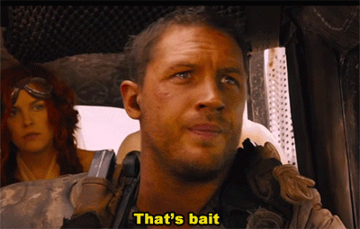

# baitless
A growing set of tools for combating malicious content on the internet

###### *This is a solo personal/recreational project by [Agustin Lorenzo](https://agustinlorenzo.com) - it's currently still a work in progress*

## About
Over time, content on the internet has become increasingly more negative and predatory. Social media posts have become more incentivized to farm engagement by making users angry - whether it be through everyday [ragebait](https://en.wikipedia.org/wiki/Rage-baiting) or from widespread, [purposefully controversial politics](https://www.theguardian.com/us-news/2025/nov/23/rightwing-influencers-outside-us-x-twitter-tool).

The **baitless** project is an attempt to "filter out the noise" and reduce the amount of harmful content that reaches the user. This will be done by training AI models to recognize various forms of "**bait**" that can then be highlighted, or even removed from the page entirely. Tentative plans include training models to recognize the following:

1. Logical fallacies
> This can be done by training models on publically available datasets that contain various types of fallacies

2. Propaganda
> As far as I am aware, there aren't any public datasets that contain explicit examples of propaganda. This may be detected in conjunction with fallacies - i.e. a logical fallacy in combination with nationalistic language could be an indicator of propaganda.

3. Informal "ragebait" from everyday users
> This will likely require gathering data from social media websites (e.g. Reddit or X) through webscrapping. The informal nature of the content will make it difficult to define the criteria for a post to be considered "ragebait," but they may be selected by level of controvery, number of likes vs. engagement, etc.

4. AI-generated text and videos
> It's unclear whether new models will be needed for this, since many people are already working on methods for detection AI-generated content. If performance is adequate, open source models should get the job done. Otherwise, models can be either be trained on public datasets, or on my own synthetic data.

### Implementation/End Goal

Once these methods for detecting the *bait* are developed, they can be filtered out through an application. In practice, this will probably look like a Chrome extension; here, the user could set thresholds for how confident the models must be content to be considered *bait*, or determine whether the *bait* should be higlighted or removed entirely (similar to adblock extensions).

There is also potential for use through an API - while the general public can use the extension, an API could be utilized to process large amounts of data. Ideally, this project would serve as a way for sites to effectively reduce the amount of *bait* by detecting it before/soon after it's posted.

---

## Progress

### 3/29/2026
So far, two models have been trained: a `fallacy *detector*` and a `fallacy *classifier*`

> Why not just use one model?
With the end goal of a Chrome extension in mind, it would be very computationally expensive to run a multilabel classifier for every string of text that's on a webpage. So, the `fallacy detector` would act as a gate that determines whether it's worth calling the `fallacy classifier` on a given text. Currently, both models are finetuned DistilBERT models to gage a baseline for performance. In the near future however, I plan to implement significantly reduce the size/complexity of the detector model. This could be done through either quanitizing or pruning the current model, or just by training another smaller model entirely (i.e. something like an LSTM - very small, but still appropriate for sequential data like natural language text).

#### *Classification metrics for both models are comming soon! This section will be updated as soon as they are evaluated.*

---
### To-do:
- [x] Train binary fallacy model
- [x] Train multi-label fallacy model
- [ ] Find way to detect propaganda
- [ ] Train AI-generated text detector (or check if needed)
- [ ] Train AI-generated image detector (or check if needed)
